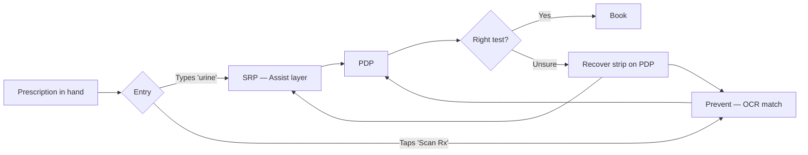

# Diagnostics SRP/PDP Disambiguation — "Urine" Search

**Working constraint (stated up front):** I have no Figma file, screenshots, or live SRP/PDP to inspect. Everything below is reasoned from the text description plus general knowledge of Indian diagnostics UX and medical shorthand. Confidence is **Medium**. Where a screen decision hinges on something I cannot see, I mark it as an assumption and note what would change my recommendation.

---

## Step 1 — Board Understanding

**What this appears to show**
Not an actual board — a described scenario. Two surfaces are implied:
1. **Search Results Page (SRP)** for the query "urine" on 1mg's Diagnostics app, returning ~7 near-identical result cards. Each card carries: test name, "Contains N tests", price, and a BOOK CTA.
2. **Product Detail Page (PDP)** users can land on after tapping the wrong card.

**Likely user goal**
"My doctor wrote Urine R (or RE, or R/M, or C/S, or ACR) on my prescription. I need to book *that specific test* — not something close to it — so my report matches what the doctor asked for."

**Flow or state shown**
Prescription in hand → open 1mg Diagnostics → type "urine" → 7 look-alike results → guess → PDP → book (possibly wrong) OR abandon.

**Important notes and annotations**
- Traffic is **doctor-initiated**, not exploratory. This changes everything: the user is not shopping, they are trying to match a specific label.
- Cards are semantically flat — no differentiator visible above "Contains N tests + price".
- The prompt explicitly asks for two moments: **help pick on SRP** and **rescue on wrong PDP**. That is a hint that both surfaces need intervention.

**Visible friction**
- Shorthand ambiguity: "Urine R", "Urine RE", "Urine R/E", "Urine Routine", "Urine R/M" are usually the *same* clinical test written differently by different doctors — but the catalog appears to list them as distinct SKUs (or at least distinct cards), so the user assumes they must be different.
- Real ambiguity too: "Urine Culture" (C/S) is a genuinely different test from "Urine Routine" (R/E), and "Urine ACR" is different again. The catalog treats aliases and true variants the same way, so the user cannot tell which axis of difference matters.
- No decision aids on the card — parameters covered, TAT, sample type, "commonly confused with" are all missing.
- BOOK is a one-tap commit, so a wrong pick becomes a wrong booking with no interstitial check.

**Assumptions (Medium confidence)**
- The 7 SKUs include both alias duplicates (Urine R ≡ RE ≡ Routine) and clinically distinct tests (Culture, ACR). If they were all one canonical SKU internally, the catalog would already collapse them — so I assume they are separate SKUs, possibly from partner-lab feed differences.
- Users mostly type the exact shorthand from the prescription; some type just "urine" and scan visually.
- Booking a wrong test has real downstream cost: refund, re-booking, delayed diagnosis, and a trust hit that's disproportionate to the price.

**Unclear points**
- Whether the underlying catalog can be re-mapped (are these truly different SKUs across labs, or duplicate listings?).
- What percentage of "urine" searchers currently book, abandon, or book-then-cancel.
- Whether a prescription-upload flow already exists elsewhere in the app.

---

## Step 2 — Reflection

Here is what I think is going on: this is a **doctor-initiated, name-matching task disguised as a search task**. The user is not exploring — they are trying to translate a doctor's shorthand into an app SKU. The SRP as it stands treats them like a shopper (name + price + book), but they are actually a translator, and the interface gives them nothing to translate with. The core tension is that the catalog is optimized for the app's structure (one SKU = one card), while the user's mental model is a single word from a paper prescription that maps ambiguously to several SKUs.

I am assuming: (a) alias overlap exists among the 7 results, (b) some real diagnostic variance also exists, and (c) rescuing on the PDP is worth doing because a nontrivial share of users will still pick wrong even with a better SRP.

---

## Step 3 — Problem Articulation

**User**
An adult patient (or caregiver booking for a family member) who has just left a doctor's appointment, holds a prescription with handwritten shorthand, and wants to book the exact test the doctor ordered. Experience with lab tests is variable; medical vocabulary is low. Emotional state: mildly anxious (there is a reason a test was prescribed), impatient (they came in to complete one task), and cautious about picking wrong.

**User goal**
Book the exact test on the prescription — no more, no less — with confidence that "this is the one the doctor meant."

**Current friction**
- **Shorthand-to-SKU mismatch:** doctors write in aliases; the SRP shows canonical (or partner-lab) names. There is no bridge.
- **Flat visual hierarchy:** all cards look the same, so the differentiator between "Urine R" and "Urine Culture" is invisible at a glance.
- **Missing decision aids:** no "commonly written as", no "used for", no parameter list, no TAT, no sample-type on the card.
- **No safety net on commit:** BOOK is one tap; wrong choices convert to wrong bookings.
- **PDP has no rescue:** once the user lands on the wrong test, nothing tells them "you might be on the wrong page."

**Product goal**
Comprehension → Conversion → Trust. In that order. If comprehension is fixed, conversion follows for this doctor-initiated audience because intent is already high. Trust is what pays the compounding return: a diagnostics brand that gets the right test the first time earns the next prescription too.

**Design challenge**
How might we turn a doctor's shorthand — written on paper, in a hurry — into the right 1mg SKU in as few decisions as possible, and make it cheap to correct a wrong turn?

**Success looks like**
- % of "urine"-search sessions that reach a *correct* PDP (proxied by no cancellation within N hours, or explicit confirmation).
- Reduction in cancel-and-rebook rate on urine tests.
- Time from search to book decreases without lift in wrong-test bookings.
- Support tickets tagged "wrong test booked" drop.

**Assumptions**
- Alias mapping (Urine R / RE / R/E / Routine → one canonical) is achievable operationally, at least at the display layer even if SKUs remain distinct behind the scenes.
- 1mg has, or can generate, a "commonly confused with" adjacency list per test.
- OCR on prescriptions is either already in the app or is a bigger bet than can ship in this cycle.

---

## Step 4 — Clarification Decision

I am proceeding without asking the user questions. The scenario carries enough signal (doctor-initiated, catalog described, both SRP and PDP flagged, ambiguity mechanism clear) to design responsibly. Medium confidence means I state assumptions rather than guess silently.

**What would change my recommendation if I learned it:**
- If most searches are one specific alias (e.g., 70% type "urine culture" exactly), the SRP problem shrinks and this becomes mostly a PDP-recovery problem.
- If the 7 SKUs are actually alias duplicates in a partner-lab feed, the correct fix is catalog consolidation, not SRP UI.
- If prescription-upload is a company priority already in flight, the SRP layer becomes an interim solution and the primary stance shifts to Prevent.

---

## Step 5 — UX Solution

### Diagnosis

The interface is treating a translation problem like a shopping problem. The SRP asks "which do you want to buy?" when the user is asking "which of these matches what my doctor wrote?" The two are not the same question, and only the second has a right answer.

### Intervention shape

Three-surface response: **Prevent** (light) → **Assist** (heavy, this is the load-bearing layer) → **Recover** (essential safety net on PDP). The center of gravity is the SRP.

### Recommended direction

**A. SRP — build a disambiguation layer above the results (the primary intervention)**

1. **Alias chips at the top of results.** As soon as the query is "urine" (or any query that returns > 3 near-name matches), render a horizontal chip row above the results labelled *"What did your doctor write?"* Chips: `Urine R / RE / R/E`, `Urine R/M`, `Urine C/S (Culture)`, `Urine ACR`, `24-hr Urine Protein`, `Other`. Tapping a chip filters the list to the single canonical SKU (with lab variants collapsed under it). This is the fastest possible translation surface.
2. **Consolidate aliases at the display layer.** Urine R, Urine RE, Urine R/E, Urine Routine, Urine Routine Examination should render as **one** result card titled "Urine Routine Examination (R / RE / R/E / R/M)" with the alias list as a subtle secondary line. If the SKUs are actually distinct across labs, the card expands to a lab picker; the user does not see 4 near-duplicates.
3. **Enrich the card so it is decision-worthy.** Each card gains three lines beneath the name:
   - `Also written as: R, RE, R/E, R/M` (or the equivalent for that test)
   - `Checks for: UTI, kidney function, protein, sugar` (patient-facing, not clinical)
   - `Sample: Urine · Report in: 24 hrs` (`48–72 hrs` for Culture)
   Price and BOOK stay on the right, unchanged.
4. **Highlight the differentiator when two results are close.** If the SRP is showing both "Urine R/E" and "Urine C/S", surface a one-line contrast on each card: *"Different from Culture — this one does not grow bacteria"* / *"Different from Routine — this one identifies bacteria and the antibiotic that works"*. Only show contrast lines when a genuine confusable is on-screen.

**B. PDP — add a rescue strip (the safety net)**

5. **Persistent "Is this the one your doctor wrote?" strip** just below the test name, before the fold. Two affordances:
   - `Yes, continue` (dismisses)
   - `Not sure — see similar tests` (opens a bottom sheet with the 2–3 commonly-confused neighbours, each with one-line differentiator and a Switch CTA)
6. **Alias line on the PDP too.** *"This test is commonly written as R, RE, R/E, R/M on prescriptions."* This is the single line that closes the loop for a user who typed "urine RE" and landed on "Urine Routine Examination" — they need to see their alias echoed back before they trust the page.
7. **"Upload prescription to verify" as a secondary CTA on the strip.** For the uncertain user, an escape hatch to the Prevent layer.

**C. Prevent — nudge Scan-Rx at the search entry (light touch)**

8. **Above the search bar on the diagnostics home:** *"Have a prescription? Scan it and we'll find your tests."* Small, present, not dominant. Assumes OCR exists or is on the near roadmap; if not, this becomes phase 2.

### Copy recommendations

| Surface | Old / missing | New |
|---|---|---|
| SRP chip row | (none) | *What did your doctor write?* |
| SRP card subline | "Contains 42 tests" | *Also written as: R, RE, R/E, R/M · Checks for: UTI, kidney, protein · Report in 24 hrs* |
| SRP contrast line (when confusable is on-screen) | (none) | *Different from Urine Culture — this test does not identify bacteria.* |
| PDP rescue strip | (none) | *Is this the test on your prescription? — [Yes, continue]  [Not sure — see similar]* |
| PDP alias line | (none) | *Commonly written as R, RE, R/E, R/M.* |
| Home search hint | "Search for tests" | *Search test name, or scan your prescription* |

### Edge cases

- **User types a truly novel alias** (regional shorthand, or a doctor's idiosyncratic scribble): the chip row includes an `Other` chip that opens a "Type what your doctor wrote" input; we then run fuzzy match against the alias table and offer the best 2 matches with confidence.
- **User is booking for a family member with a different prescription:** the rescue strip must not persist across bookings; reset per-session.
- **Culture (48–72 hr TAT) mistaken for Routine (24 hr):** this is the highest-cost error; the contrast line explicitly names TAT.
- **Doctor prescribed a bundle (e.g., "Urine R + Culture"):** the SRP should detect co-prescription patterns and offer a bundle chip when both appear on the same slip; low priority for v1, but flag it.
- **Prescription is illegible even to the user:** the "Not sure" path in the rescue sheet ends with "Talk to a 1mg advisor" — a soft escalation.
- **PDP arrived via a shared link (not from SRP):** the alias line still works; the rescue strip is still valuable because the sharer may have picked wrong.

### Tradeoffs and risks

- **Alias consolidation is a catalog decision, not just a UI decision.** If a partner lab insists their SKU is distinct, we render alias grouping at the *display* layer only and preserve SKUs underneath. This is more engineering but it is the honest fix.
- **Chip row real estate cost:** on a small phone, chips push the first result below the fold. Mitigation: chips only render when the query returns > 3 near-name matches; single-clear-match queries skip the chip row entirely.
- **Rescue strip may be dismissed reflexively** (banner blindness). Keep it low-chrome, sentence-shaped, not banner-shaped. Measure dismiss vs. engagement rates.
- **"Doctor also writes as" is patient-facing medical claim territory.** Legal/medical review needed on the alias table; do not user-generate it.
- **Metrics risk:** if we only measure conversion, we will not see the trust return. Instrument correct-test bookings (proxy: no cancel within N days) as a first-class metric.

### Next step

Prototype the SRP chip row + enriched card + PDP rescue strip in a mid-fidelity wireframe, then usability-test with 6–8 users who arrive with a real (or realistic) urine-test prescription — half handed "Urine R", half handed "Urine C/S". Measure: correct SKU reached, time to decision, and self-reported confidence at the moment of tapping BOOK.

---

### Stance Check

**1. Which stance is the primary one in the solution?**

**Assist.** The SRP disambiguation layer (chips, alias-consolidated cards, enriched sublines, contrast lines) is doing the heaviest work. Prevent (Scan-Rx nudge) is present but a lightweight secondary. Recover (PDP rescue strip) is essential but is a safety net, not the load-bearing layer.

**2. If I led with a different stance, what would the solution look like?**

The Prevent-first version treats the search bar itself as a fallback and makes prescription capture the front door. The diagnostics home reorganizes so that the primary CTA is *"Snap your prescription — we'll find every test on it, in one tap."* Camera opens directly; OCR extracts every test name; a review screen shows each detected test as a card with alias resolution already done ("Urine R → Urine Routine Examination — is this right?"), and the user confirms in a checklist. Booking a full-panel prescription becomes one flow instead of N searches. Search stays available but demoted to a "know exactly what you want?" secondary path, and even inside search, typing an ambiguous term interrupts with "Or scan your prescription for an exact match?" before showing results. The bet is that the *entire class* of ambiguous-name errors disappears if the user never has to type a shorthand at all. Investment goes into OCR accuracy on handwritten Indian prescriptions, an alias dictionary that maps recognized text to canonical SKUs, and a review UI that makes correction cheap when OCR guesses wrong.

**3. Given the constraints, is the chosen primary the right one? Why not the other two?**

Yes, Assist is right, given the constraints and what I can infer.

*Why not Prevent as primary:* Prevent depends on OCR working reliably on handwritten prescriptions in multiple Indian scripts and doctor-specific handwriting, plus an alias dictionary rich enough to resolve regional shorthand. That is a real engineering and content bet, likely a quarter or more, and its adoption is unproven — users who are already typing "urine" have demonstrated they will use search. Prevent is the right long-term direction and should ship in parallel, but making it primary today means either (a) the SRP stays broken while Prevent is built, or (b) we ship a weak Prevent that erodes trust. Assist ships in weeks and helps every session that already exists.

*Why not Recover as primary:* Recover only helps users who (i) reach the PDP, (ii) notice something is off, and (iii) act on the strip before tapping BOOK. That excludes the confident-but-wrong user — the one who is sure "Urine R" and "Urine Routine" must be the same because the names are so close, taps BOOK on the first one, and only discovers the mismatch when the report arrives. Recover cannot save that user because they never doubted. Assist can, because it never presents that ambiguity in the first place. Recover is essential as a safety net and belongs in v1, but it is not where the leverage is.

Assist is where the interface can move the most sessions the most confidently. Prevent is the compounding bet for the next cycle. Recover is the seatbelt.

---

## Step 6 — Artifact Router

The user did not name a specific artifact. Per the router, I answered with the UX solution in text (above) and now recommend the most useful next artifact.

### Artifact Decision

**Selected artifact**
A **mid-fidelity wireframe** of three surfaces: (1) the SRP with alias chips, consolidated cards, and enriched sublines; (2) the PDP with rescue strip and alias line; (3) the "similar tests" bottom sheet triggered from the rescue strip.

**Reason**
The recommendation lives or dies on layout choices — where the chip row sits, how the alias line reads on a card at phone width, whether the rescue strip competes with BOOK on the PDP. Text can describe these, but the tradeoffs (chip row pushing the first result below the fold, alias line crowding the price, rescue strip persistence) only become real when drawn. A wireframe is also the cheapest artifact to iterate against a usability test with 6–8 prescription-holding users, which is the natural next validation step. Skipping to high-fidelity Figma is premature because the alias-grouping decision may still need catalog input, and skipping to a PRD is premature because the layout tradeoffs are not yet resolved.

**Subskill to call**
`references/wireframe.md`

**Next-most-useful after that**
`references/research-script.md` — a short usability script for a prescription-in-hand task, so the wireframe validates against the actual translation moment, not a hypothetical one.
